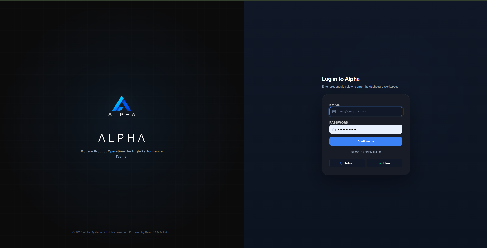
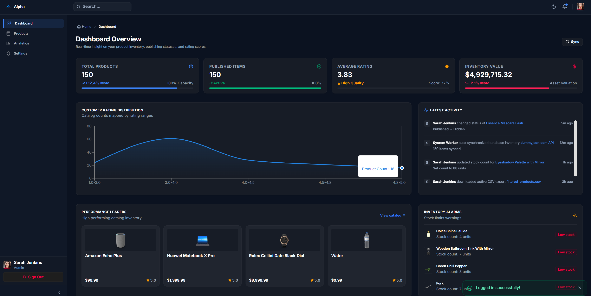
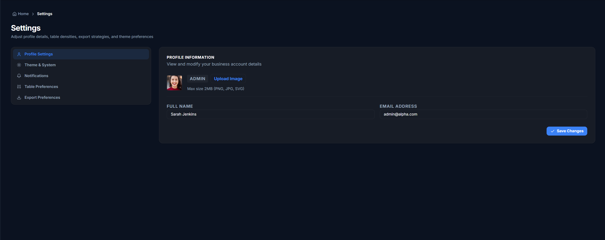

# <p align="center">▲ ALPHA</p>

<p align="center">
  <strong>Enterprise SaaS Admin Dashboard & Product Management System</strong>
</p>

<p align="center">
  A premium, high-performance product operations and inventory catalog workspace inspired by the minimal aesthetics of Vercel, Stripe, Linear, and Notion.
</p>

<p align="center">
  <a href="https://sushmita-portfolio-five.vercel.app"><strong>Explore Live Demo »</strong></a>
  ·
  <a href="https://github.com/sushmita-rgb/alpha-admin"><strong>View Repository »</strong></a>
</p>

<p align="center">
  
  
  
  
  
  
  
  
  
  
  
</p>

---

## 📌 About The Project

**Alpha** is a production-ready, enterprise-grade Product Operations Dashboard built for seamless inventory management, customer analytics, and role-based administration. Designed with high-performance workflows in mind, it provides developers and product managers with real-time insight into store catalogs, product valuations, rating metrics, and publishing states.

Inspired by industry leaders like Stripe, Vercel, and Linear, the application features a distraction-free, border-focused aesthetic that scales gracefully from mobile viewports to ultra-wide displays.

---

## ⚙️ Core Features

- [x] **Secure Authentication**: Role-based access control out of the box.
- [x] **Granular Workspace Permissions**: 
  - `Admin`: Full permissions to toggle item visibility, view analytical valuations, sync catalogs, and manage column layouts.
  - `User`: Standard read-only credentials targeting product catalogues, listings, and specific configurations.
- [x] **Analytics Dashboard**: Custom Recharts visualization of category counts, weekly valuations, and customer rating trends.
- [x] **TanStack Data Grid**: Fully-featured catalog lists supporting pagination, sorting (price, rating, name), and multi-category filters.
- [x] **Dynamic Column Controls**: Toggle column visibilities and reorder headers via interactive drag-and-drop.
- [x] **Active State URL Syncing**: Search queries, filters, and page index parameters serialize directly into the browser URL for robust shareability.
- [x] **Background Polling Service**: Automatic background synchronization (every 10 seconds) to ensure inventory metrics are kept updated.
- [x] **CSV Inventory Extraction**: One-click catalog export capability supporting standard tabular CSV sheets.
- [x] **Cohesive Dark/Light Modes**: Standardized theme configurations aligned with clean Notion variables.

---

## 🛠️ Tech Stack

| Technology | Category | Icon / Badge | Description |
| :--- | :--- | :---: | :--- |
| **React 19** | Core Framework | `React` | Next-generation React featuring optimized rendering pipelines. |
| **Vite** | Build Tooling | `Vite` | Instant server start and lightning-fast HMR builds. |
| **Tailwind CSS** | Styling System | `CSS` | Utility-first CSS configuration using theme variables. |
| **Zustand** | State Store | `State` | Lightweight, reactive store to manage global authentication states. |
| **TanStack Query** | Server State | `Query` | Robust data fetching, caching, and client synchronizations. |
| **TanStack Table** | Data Grids | `Table` | Headless table manager for column drag-and-drop and sorting. |
| **React Router** | Routing Core | `Router` | Declarative, nested routing structure with Private Route locks. |
| **Recharts** | Data Charts | `Charts` | Declarative, responsive React charts for dashboard analytics. |
| **Framer Motion** | Animation | `Motion` | High-fidelity, GPU-accelerated layout and hover transitions. |
| **Axios** | API Clients | `API` | Promise-based HTTP client supporting backend interfaces. |

---

## 📂 Folder Structure

```text
src/
├── assets/         # Project images, icons, and base assets
├── components/     # Reusable layout fragments (Breadcrumbs, Toasts)
├── features/       # Core app modules
│   ├── analytics/  # Dashboard visuals and Recharts graphs
│   ├── auth/       # Login configurations and feature copy
│   ├── products/   # Catalog lists, filter toolbars, specs
│   └── settings/   # Profile configuration panels
├── hooks/          # Custom hooks (Debounced search input)
├── layouts/        # Unified layout definitions (Sidebar, Header)
├── routes/         # Private & public route wrappers
├── services/       # Mock database API connections
├── store/          # Zustand global store states
├── utils/          # Formatting helpers (currencies, number parsers)
├── App.jsx         # App router entries
└── index.css       # Notion design theme styles
```

---

## 🖼️ Application Showcases

#### 🔑 Login Interface


#### 📈 Analytics Dashboard


#### ⚙️ Settings Panel


---

## ⚡ Quick Start

### Prerequisites
Make sure you have Node.js (version 18 or above) installed on your system.

### 1. Clone the repository
```bash
git clone https://github.com/sushmita-rgb/alpha-admin.git
cd alpha-admin
```

### 2. Install dependencies
```bash
npm install
```

### 3. Run development server
```bash
npm run dev
```
Open **[http://localhost:5173](http://localhost:5173)** in your browser to explore the dashboard.

### 4. Build for production
```bash
npm run build
```

---

## 🔐 Credentials

Use the following predefined mock accounts to explore role-based permissions:

| Account Type | Email Address | Password | Permissions |
| :--- | :--- | :--- | :--- |
| **Administrator** | `admin@alpha.com` | `123456` | Edit catalog visibility, sync database, drag columns, view charts. |
| **Standard User** | `user@alpha.com`  | `123456` | Read-only catalog access, search, and page listings. |

---

## ⚡ Performance Optimizations

- **Debounced Search Querying**: Form search controls leverage custom debouncing hooks to delay API fetches, preventing excessive network workloads.
- **React.memo Layout Renderers**: Sidebar lists, headers, and breadcrumbs are wrapped in memoized renders to prevent re-evaluation on parent updates.
- **useMemo Computation Caching**: Heavily nested stats calculation (e.g. total value summaries, rating categories arrays) are cached to maintain fluid `60fps` layout transitions.
- **Subtle Background Polling**: Keeps data fresh in the background via quiet interval queries, failing silently without layout flash.

---

## 📱 Responsive Layouts

Alpha is fully optimized across multiple device formats:
* 🖥️ **Desktop Layout**: Collapsible sidebars, horizontal navigation headers, and multi-column tables.
* 📟 **Tablet Layout**: Simplified grids, auto-wrapping filters, and responsive Recharts charts.
* 📱 **Mobile Layout**: Bottom navigation shelves, single-card catalog views, and full-screen overlay menus.

---

## 🚀 Roadmap

- [ ] **Real-time Notifications**: Support alerts when product stocks fall below threshold values.
- [ ] **WebSocket Catalog Feed**: Live database integrations with push messages.
- [ ] **Analytical Exports**: Option to download dashboard metrics as formatted PDFs.
- [ ] **Localization**: Complete support for multi-language workspaces.

---

## 👤 Author

* **Sushmita Singh**
  * GitHub: [@sushmita-rgb](https://github.com/sushmita-rgb)
  * Portfolio: [sushmita-portfolio-five.vercel.app](https://sushmita-portfolio-five.vercel.app)
  * LinkedIn: [Sushmita Singh Profile Placeholder](https://www.linkedin.com/in/)

---

## 📄 License

Distributed under the MIT License. See [LICENSE](LICENSE) for more details.

---

<p align="center">
  ⭐ If you like this project, please consider giving it a star!
</p>
